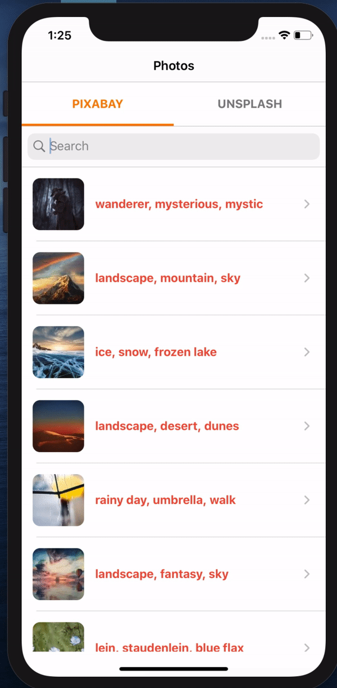

# DataSource Photos API - PixaBay & Unsplash

In this Code, I write about:

## Info about Application 

- DataSource API for Photos
- Photo's Details

## Compatibility

- Written in Swift 5 and requires Xcode 11.0
- PhotosApi is compatible with iOS 13.0+.
- Using Swift Package Manager, I have used [SDWebImage](https://github.com/SDWebImage/SDWebImage.git) for Image Download and cache store.

#### Thank you

<h3 align="center">

</h3>

